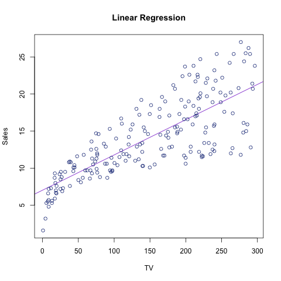

# Stat 159 Homework 2

# Simple Regression Analysis  
## Andrea Widjaja  
### Oct 07, 2016

# Abstract  
In this report we reproduce the main results displayed in section 3.1 Simple Linear Regression (ch.3) of the book *An Introduction to Statistical Learning*.

# Introduction  
The overall goal is to provide advice on how to improve sales of the particular product. Association..  

# Data  
# Methodology
# Results
# Conclusions

Is there a relationship between advertising budget and sales?
How strong is the relationship between advertising budget and sales?
Which media contribute to sales? tv?

$$ sales = \beta_0 + \beta_1 * TV $$
linear relationship, regressing Y onto X: $$ Y = \beta_0 + \beta_1X $$
 

